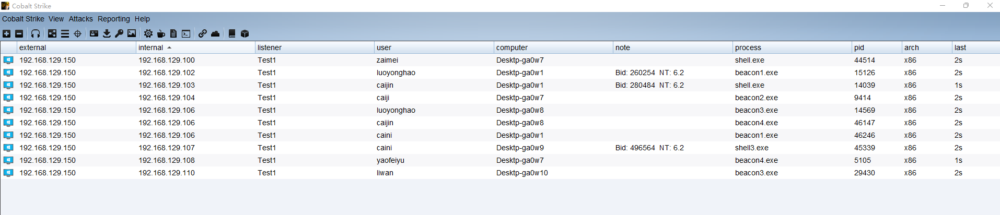
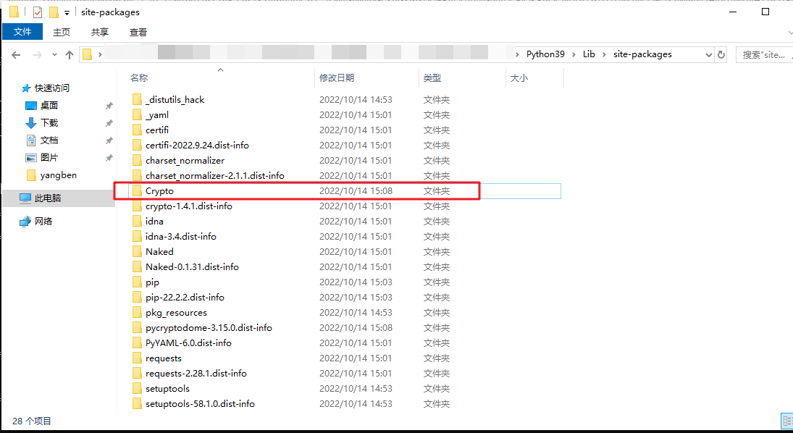

# 工具使用示例例：

``ip.txt username.txt processname.txt computername.txt``这四个文件是伪造上线流量的字典文件，需要自己填充，初始化随便写了几个进去：

cobaltstrikefakeup.py这个是运行的脚本文件：使用的时请至少传入两个参数

-U 心跳url

-P 公钥

可选参数：

-T 上线machine的个数（上线设成了100，需要的调整可以去修改源码）

如下运行示例：

```
python  cobaltstrikefakeup.py  -T 10(上线机器数) -U http://192.168.129.132/updates.rss(心跳url) -P MIGfMA0GCSqGSIb3DQEBAQUAA4GNADCBiQKBgQCNUL6+gTcsl1/M1vjCOFsJY2lMm4i5HA4TPki0VH77n57ELBv5H/8pzuWSGtL9n+n+FDiUh4WF84nX6W6dd4Vs8XZEfcbQLpYM10aW0FpVdSVwGxTum9ZilrXMG9UmZOgNtbugwY4eRSxO9ILAnwxXqGbymdSC7VhgSc9E8dNMtQIDAQAB(公钥)
```

运行截图如下：


上线效果：



# 工具使用过程中可能会出现的问题

运行时如果报错找不到找不到Crypto.Cipher相关，请检查如下路径：

``python home目录\Lib\site-packages``

将该路径下的**crypto**文件夹名修改**Crypto**即可：




<video src="./cobaltstrike fakeup.mp4"></video>

  


